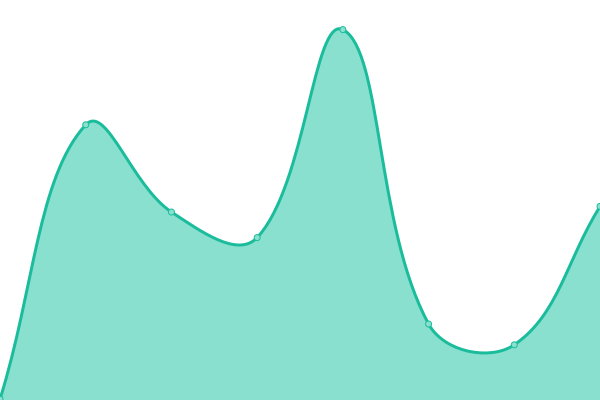

# [📈 Live Status](https://status.vale.rocks): <!--live status--> **🟩 All systems operational**

This repository contains the open-source uptime monitor and status page for [Declan Chidlow](vale.rocks), powered by [Upptime](https://github.com/upptime/upptime).

With [Upptime](https://upptime.js.org), you can get your own unlimited and free uptime monitor and status page, powered entirely by a GitHub repository. We use [Issues](https://github.com/DeclanChidlow/status/issues) as incident reports, [Actions](https://github.com/DeclanChidlow/status/actions) as uptime monitors, and [Pages](https://status.vale.rocks) for the status page.

<!--start: status pages-->
<!-- This summary is generated by Upptime (https://github.com/upptime/upptime) -->
<!-- Do not edit this manually, your changes will be overwritten -->
<!-- prettier-ignore -->
| URL | Status | History | Response Time | Uptime |
| --- | ------ | ------- | ------------- | ------ |
|  [Vale.Rocks](https://vale.rocks) | 🟩 Up | [vale-rocks.yml](https://github.com/DeclanChidlow/status/commits/HEAD/history/vale-rocks.yml) | 

 372ms
     
 | 

<a href="https://status.vale.rocks/history/vale-rocks">100.00%</a>
    

|  [Fedi](https://fedi.vale.rocks) | 🟩 Up | [fedi.yml](https://github.com/DeclanChidlow/status/commits/HEAD/history/fedi.yml) | 

 795ms
     
 | 

<a href="https://status.vale.rocks/history/fedi">100.00%</a>
    

|  [AutoMod Website](https://automod.vale.rocks) | 🟩 Up | [auto-mod-website.yml](https://github.com/DeclanChidlow/status/commits/HEAD/history/auto-mod-website.yml) | 

 163ms
     
 | 

<a href="https://status.vale.rocks/history/auto-mod-website">100.00%</a>
    

|  [AutoMod Bot](https://automod.vale.rocks/dashboard) | 🟩 Up | [auto-mod-bot.yml](https://github.com/DeclanChidlow/status/commits/HEAD/history/auto-mod-bot.yml) | 

 18ms
     
 | 

<a href="https://status.vale.rocks/history/auto-mod-bot">100.00%</a>
    

|  [Jellyfin](https://jellyfin.vale.rocks) | 🟩 Up | [jellyfin.yml](https://github.com/DeclanChidlow/status/commits/HEAD/history/jellyfin.yml) | 

 1607ms
     
 | 

<a href="https://status.vale.rocks/history/jellyfin">100.00%</a>
    

<!--end: status pages-->

[**Visit our status website →**](https://status.vale.rocks)

## 📄 License

- Powered by: [Upptime](https://github.com/upptime/upptime)
- Code: [MIT](./LICENSE) © [Declan Chidlow](vale.rocks)
- Data in the `./history` directory: [Open Database License](https://opendatacommons.org/licenses/odbl/1-0/)
